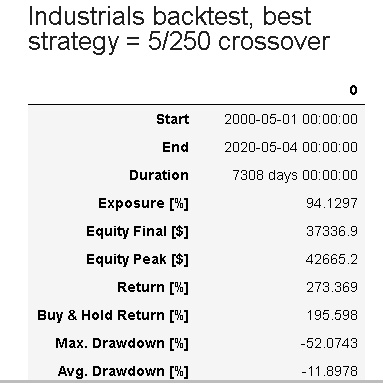

# p1-Formula_1 

**PROCESS**

We completed a broad Monte Carlo survey of the 11 sectors that make up the S&P500. We used the S&P500 because it a widely followed index, represents 80% of the current value of the market and currently has trillions of dollars indexed to it. 

Stock history data from 2003 to the present was downloaded from Alpaca. We used 11 sector etfs that track the 11 sectors of the S&P 500: 

1. XLK  Technology Select Sector SPDR Fund
2. XLB  Materials Select Sector SPDR Fund
3. RWR  Wilshire REIT ETF
4. XLI  Industrials Select Sector SPDR Fund
5. XLY  Consumer Discretionary Select SPDR Fund
6. XLP  Consumer Staples Select SPDR Fund
7. XLE  Energy Select SPDR Fund
8. XLF  Financials Select SPDR Fund
9. XLU  Utilities Select SPDR Fund
10. XLV  Health Care Select SPDR Fund
11. IYT  Transports Select SPDR Fund

We computed betas, standard deviations, correlations, sharpe ratios, daily return plots and frequency distributions for each sector. We calculated how much a $10,000 investment would have grown over time. Finally, we calculated a 95% confidence interval for the next 30 days. 

Daily returns

Monte Carlo

Freq distribution

After the Monte Carlo analysis we used two python libraries to look deeper:

1. *PyPortfoliOpt*

With PyPortfoliOpt we calculated covariances and expected returns and ran the 11 sectors through an optimizer to find a max sharpe ratio portfolio. We then compared this portfolio to an equally weighted portfolio of the sector etfs. 

2. *Backtesting.py*

Next we used Backtesting.py with the goal of developing the best moving average crossover strategy for each sector. Two moving averages for each sector were analyzed - one short term and one long term. The trading strategy tested was: Buy - when the short term goes through the long term on an upswing.  Sell - when the short term goes through long term on a downswing. Backtesting.py found the best moving averages to use for each sector.

**RESULTS**

1. Sharpe ratio analysis showed Consumer Staples, Health Care and Technology sectors as the sectors with the highest ratios and  Financials and Energy with the lowest. 

2. A correlation matrix showed Energy and Real Estate as sectors with the lowest correlations to other sectors. Technology and Material had higher correlations with other sectors. 
 

3. Over the long-term time there is variability in returns suggesting good sector selection can increase performance. 

Poor performance -Energy

Good performance - Technology

4. Monte Carol analysis confidence intervals allowed us to define a trading range for a $10,000 investment over the next 30 days with a 95% probability. For example, 10,000 invstment in the Real Estate sector is expected to be 8245 to 12,542 in 30 days. Real Estate had the highest range. The sector with the lowest range was Consumer Staples (9210 to 11,112). 

All of the sectors fall in the range 8200 to 12,542 and in general more upside means more downside risk which makes it difficult to say that one sector looks best. The use of 30 day Monte Carlo results depends on the investor's perspective. If one is focused on preserving assets then Consumer Staples has the least downside from a Monte Carlo perspective. If one is focused on the upside then Real Estate would be the sector to choose (although downside risk would be higher). In this way Monte Carlo can help manage risk of a porfolio. 

Although beyond our scope, Monte Carlo could also be used to create sector models with Monte Carlo analysed inputs (for example, oil price for energy) to make the 30 day forecasts more accurate. 

5. Backtesting produced trading strategies for four sectors (Industrials, Technology, Financials, Energy) that beat a buy and hold portfolio return. We could not find a trading strategy to beat buy and hold for the other 7 sectors. 

Industrials

Technology

Financials

Energy

6. PyPortfolioOpt was used to calculate expected returns and covariance to optimize the 11 sectors to find a portfolio with the highest sharpe ratio. 

The max sharpe ratio portfolio was:

1. 26% Technology
2. 34% Consumer Staples
3. 22% Utilities
4. 18% Health Care

This portfolio completely eliminated 7 sectors from the portfolio. (One caveat - PyPortfolioOpt has several methods to calculate expected returns and covariances. Different combinations of methods can produce different results. It also possible to constrain the optimization to have a min and max percent in each sector. We ran an unconstrained portfolio so the optimization was free to take sectors to a zero weighting.) 

Compared to equally weighted portfolio the optimized portfolio outperformed. However, it is possible this outperformance comes from data mining/overfitting the data. 

This portfolio has four sectors. Backtesting showed that only in Technology could we beat a buy and hold strategy with a crossover trading strategy (10 sma, 95 sma). One possible improvement on the optimized portfolio would be to buy and hold Consumer Staples, Utilities, and Health Care in the recommend weights while implementing a 10 day sma/95 day sma trading strategy in technology. 

